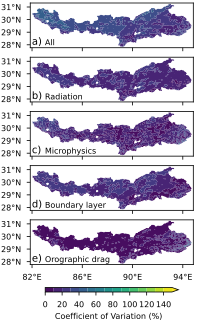
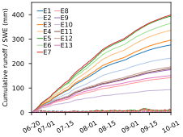
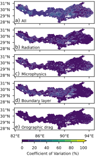
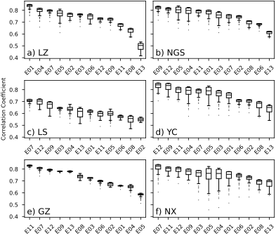

<!-- markdownlint-disable MD013 MD025 -->

# Supporting Information for "Evaluation of atmospheric models over mountainous regions using a parsimonious network routing model and streamflow observations: A case study of the Yarlung Zangbo River on the Tibetan Plateau" {-}

Heng Yang¹, Shuanglong Chen², Qingyun Bian³, and Hui Zheng³

¹Science and Technology Research Institute, China Three Gorges Corporation, Beijing 101100, China

²Baihetan Hydropower Plant, China Yangtze Power Co., Ltd., Liangshan 615400, China

³Institute of Atmospheric Physics, Chinese Academy of Sciences, Beijing 100029, China

Corresponding author: Hui Zheng (<zhenghui@tea.ac.cn>)

# Contents of this file {-}

1\. [@tbl:kge_rank]

2\. [@fig:precipitation_coefficient_of_variation] to [@fig:streamflow_passthrough]

Table: Spearman's correlation coefficient between the rank of the median correlation coefficient measured by streamflow and the rank measured by other observations or skill measures across the WRF experiments. {#tbl:kge_rank}

|   Gauge   | Calibration | Runoff | Precipitation (Temporal) | Precipitation (Spatial) |
| :-------: | :---------: | :----: | :----------------------: | :---------------------: |
|   Lazi    |    0.99     |  0.88  |          −0.76           |          −0.70          |
|  Nugesha  |    0.97     |  0.28  |           0.37           |          0.21           |
|   Lhasa   |    0.97     |  0.24  |           0.57           |          0.32           |
|  Yangcun  |    0.95     |  0.22  |           0.31           |          0.15           |
| Gengzhang |    0.99     | −0.79  |           0.52           |          0.82           |
|   Nuxia   |    0.90     |  0.31  |           0.34           |          0.02           |

{#fig:precipitation_coefficient_of_variation}

{#fig:rnswe_time_series}

{#fig:evapotranspiration_coefficient_of_variation}

{#fig:pretdiff_coefficient_of_variation}

{#fig:optimal_cc_outlier}

{#fig:streamflow_rho}

![Statistical significance of Kling--Gupta Efficiency (KGE) differences across WRF experiments at gauges: (a) Lazi, (b) Nugesha, (c) Lhasa, (d) Yangcun, (e) Gengzhang, and (f) Nuxia. Each panel shows a pairwise comparison matrix between experiments: the x-axis lists one experiment and the y-axis lists another. For the square cell at the intersection of an experiment pair, a gray fill indicates that the KGE difference between the two experiments is statistically significant at the 0.05 level based on a paired t-test; a white fill indicates the difference is not significant at the 0.05 level.](fig/kge_difference_significance.svg){#fig:kge_significance}

![Same as [@fig:kge_significance], but for correlation coefficient.](fig/rho_difference_significance.svg){#fig:rho_significance}

{#fig:rho_rank}

{#fig:streamflow_passthrough}
